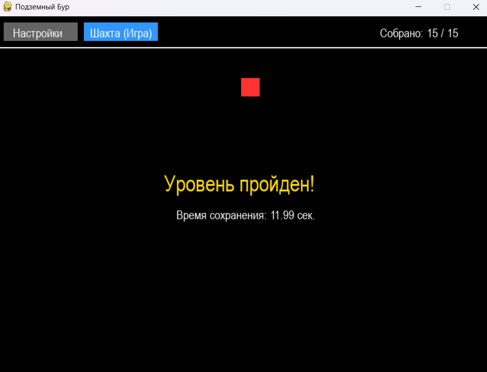

# Underground Drill App — Подземный Бур (Сбор кристаллов)

Приложение представляет собой 2D-игру с полноценным графическим интерфейсом, полностью реализованным средствами библиотеки Pygame с применением объектно-ориентированного программирования (ООП).

## Возможности

* **Две функциональные вкладки:**
  * Вкладка `Настройки` для конфигурирования параметров уровня.
  * Вкладка `Шахта (Игра)` для игрового процесса.
* **Кастомный Spinbox:** Настройка количества кристаллов на уровне (от 5 до 15 шт.) с помощью кнопок `+` и `-`.
* **Класс Машина-бур (`Drill`):** Реализация управления игровым объектом (квадратом) с помощью стрелок клавиатуры во всех направлениях.
* **Случайная генерация (`Crystal`):** Автоматическое размещение мелких желтых кругов (кристаллов) в случайных координатах шахты.
* **Система сбора и финиша:** 
  * Проверка коллизий бура с кристаллами и инкремент счетчика.
  * Фиксация времени прохождения уровня с помощью модуля `time`.
  * Автоматическое сохранение результатов игры (кол-во кристаллов и время) в текстовый файл `game_results.txt`.

## Установка зависимостей

```bash
pip install pygame
```

## Запуск

Запустите главный файл скрипта через вашу среду разработки (например, Visual Studio по клавише `F5`) или через терминал:

```bash
python PythonApplication8.py
```

## Использование

1. Перейдите на вкладку **Настройки**.
2. Выберите желаемое количество кристаллов на уровне с помощью кнопок `+` и `-`.
3. Нажмите кнопку **Генерировать шахту** (игра автоматически переключит вас на игровое поле).
4. Управляйте красным квадратом с помощью **стрелок на клавиатуре**, чтобы собрать все желтые кристаллы.
5. После сбора всех предметов на экране отобразится сообщение об успешном прохождении, а результат запишется в файл.

## Скриншоты

Ниже приведены примеры работы приложения.

### Вкладка «Настройки»


### Вкладка «Шахта (Игра)»


